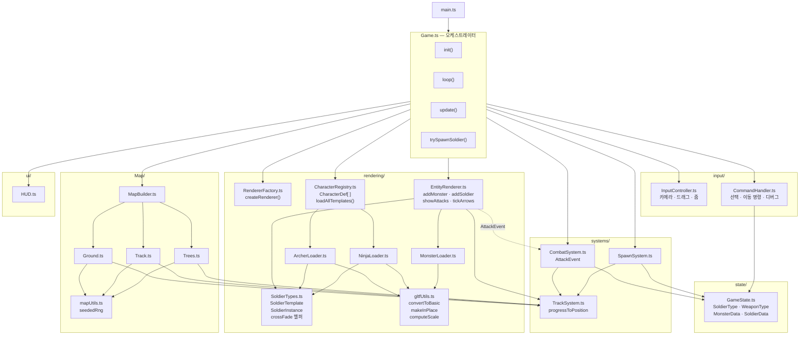

# MankindDeference

인류 문명의 진화를 테마로 한 WebGPU 타워 디펜스 게임.  
석기 → 청동기 → 중세 → 근현대 → SF 시대를 거치며 병사와 몬스터가 함께 진화한다.

## 기술 스택

| 항목 | 내용 |
|------|------|
| 렌더링 | Three.js r184 (WebGPU Renderer) |
| 빌드 | Vite + TypeScript |
| 물리/루프 | 직접 구현 (requestAnimationFrame) |
| 멀티플레이어 | 미정 |

## 조작 방법

| 입력 | 동작 |
|------|------|
| 좌클릭 드래그 | 병사 다중 선택 |
| 좌클릭 | 병사 단일 선택 |
| Ctrl + 좌클릭 | 선택 추가/해제 |
| 우클릭 | 선택된 병사 이동 명령 |
| 마우스 휠 | 줌 인/아웃 |
| 방향키 | 카메라 이동 |
| W / S | 카메라 높이 조절 |
| R | 공격 사거리 링 표시 토글 (디버그) |
| ESC | 선택 해제 |

---

## 아키텍처



---

## 모듈 설명

### `state/`
순수 데이터 타입과 초기 상태. Three.js · 시스템에 **의존하지 않음**.

| 파일 | 역할 |
|------|------|
| `GameState.ts` | `SoldierType`, `WeaponType`, `MonsterData`, `SoldierData`, `GameState` 타입 정의 |

### `systems/`
게임 로직. Three.js에 **의존하지 않음**.

| 파일 | 역할 |
|------|------|
| `TrackSystem.ts` | 원형 트랙 경로 계산, `progressToPosition()` |
| `SpawnSystem.ts` | 몬스터 스폰 타이머 |
| `CombatSystem.ts` | 병사-몬스터 전투, `AttackEvent` 생성 |

### `rendering/`
Three.js 씬 조작 전담.

| 파일 | 역할 |
|------|------|
| `RendererFactory.ts` | WebGPU 렌더러 + 씬 + 카메라 초기화 |
| `gltfUtils.ts` | GLTF 공통 유틸 (`convertToBasic`, `makeInPlace`, `computeScale`) |
| `MonsterLoader.ts` | Warrok 모델 로더 |
| `ArcherLoader.ts` | Archer 모델 로더 → `SoldierTemplate` 반환 |
| `NinjaLoader.ts` | Ninja 모델 로더 → `SoldierTemplate` 반환 |
| `SoldierTypes.ts` | `SoldierTemplate` · `SoldierInstance` 공통 인터페이스, crossfade 팩토리 |
| `CharacterRegistry.ts` | 캐릭터 정의 목록(`CharacterDef[]`), 템플릿 캐시 |
| `EntityRenderer.ts` | 씬 엔티티 추가/제거/업데이트, 투사체/파티클 관리 |

> 새 캐릭터 추가: `XxxLoader.ts` 신규 생성 → `CHARACTER_DEFS`에 항목 한 줄 추가 → `SoldierType`에 타입 리터럴 추가

### `input/`
입력 이벤트 처리.

| 파일 | 역할 |
|------|------|
| `InputController.ts` | 카메라 pan/zoom/드래그 선택박스 등 저수준 입력 |
| `CommandHandler.ts` | 선택 rect 투영, 우클릭 이동 명령(레이캐스트), 디버그 키 |

### `Map/`
정적 씬 지오메트리.

| 파일 | 역할 |
|------|------|
| `MapBuilder.ts` | 조명 + Ground + Track + Trees 조립 |
| `Ground.ts` | 바닥, 풀 패치, 바위, 그림자 오버레이 |
| `Track.ts` | 원형 트랙 (노면, 에지, 방향 화살표) |
| `Trees.ts` | 트랙 외곽 나무 |
| `mapUtils.ts` | `seededRng()` — xorshift32 시드 난수 |

### `ui/`

| 파일 | 역할 |
|------|------|
| `HUD.ts` | 골드 · 병사 수 · 게임오버 표시, 병사 소환 버튼 |

---

## 개발 환경

```bash
npm install
npm run dev     # http://localhost:3000
npm run build
```

---

## 개발 로드맵

| 단계 | 내용 | 상태 |
|------|------|------|
| Phase 0 | 프로젝트 셋업 | ✅ |
| Phase 1 | MVP (몬스터·병사·전투·HUD) | ✅ |
| Phase 1.5 | Archer 캐릭터 | ✅ |
| Phase 1.6 | RTS 선택·이동 | ✅ |
| Phase 1.7 | 다중 캐릭터 시스템 (Ninja 추가) | ✅ |
| Phase 2 | 진화 시스템 (시대·자원·유닛 트리) | 🔜 |
| Phase 3 | 몬스터 진화 | 🔜 |
| Phase 4 | 멀티플레이어 | 🔜 |
| Phase 5 | 폴리싱 | 🔜 |
